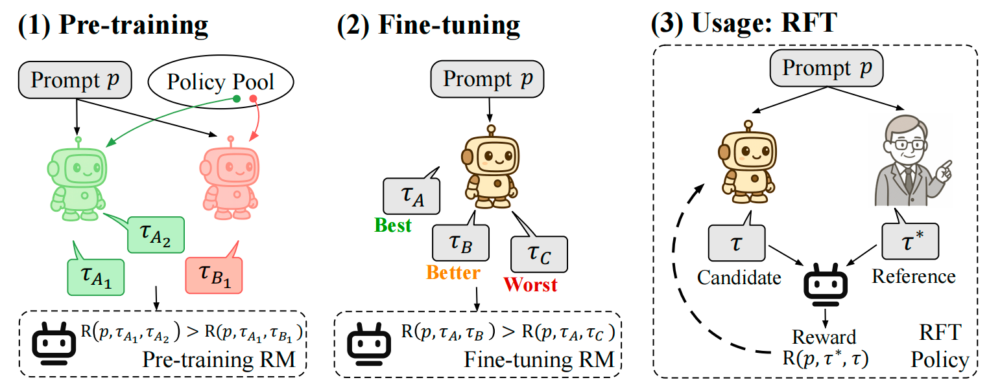
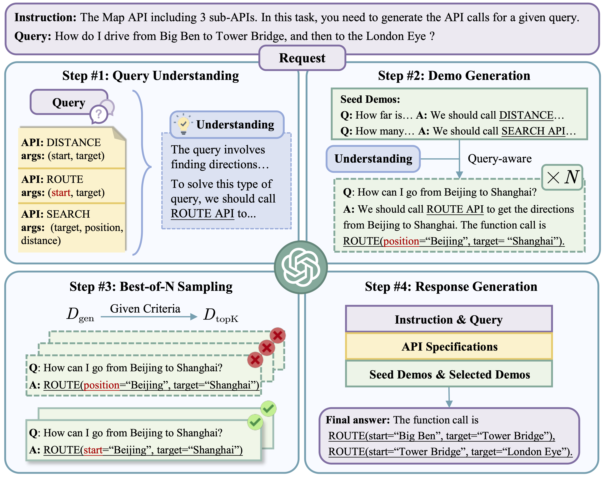








<!--
 My research interest includes neural machine translation and computer vision. I have published more than 100 papers at the top international AI conferences with total <a href='https://scholar.google.com/citations?user=DhtAFkwAAAAJ'>google scholar citations <strong>260000+</strong></a> (You can also use google scholar badge ).
-->
I'm currently a Master's degree student (from fall, 2024) at the [School of Computer Science](https://cs.fudan.edu.cn/) of [Fudan University](https://www.fudan.edu.cn/) and a member of the [FudanNLP Lab](https://nlp.fudan.edu.cn/), advised by Prof. [Xuanjing Huang (黄萱菁)](https://xuanjing-huang.github.io/).

# 🔥 News
- *2024.7*: &nbsp;🎉🎉 Our paper on Reward Model Pre-training, POLAR, is now available on !
- *2024.5*: &nbsp;🎉🎉 One paper on math reasoning & RL was accepted by **ICML-2024**!
- *2024.3*: &nbsp;🎉🎉 One paper on in-context learning was accepted by **NAACL-2024-Findings**!
- *2023.12*: &nbsp;🎉🎉 One paper on evaluation was accepted by **AAAI-2024**!

# 📝 Publications 

## Reinforcement Learning

Arxiv

POLAR: Policy-Discriminative Pre-training for Generalizable Reward Models \\
Shihan Dou\*<small>‡</small>, **Shichun Liu**\*<small>‡</small>, Yuming Yang\*, Yicheng Zou\*<small>†</small>, Yunhua Zhou, Shuhao Xing, Chenhao Huang, Qiming Ge, Demin Song, Haijun Lv, Songyang Gao, Chengqi Lv, Enyu Zhou, Honglin Guo, Zhiheng Xi, Wenwei Zhang, Qipeng Guo, Qi Zhang, Xipeng Qiu, Xuanjing Huang, Tao Gui<small>†</small>, Kai Chen<small>†</small>
 <small>\*Equal contributions. †Corresponding authors. ‡Work done during an internship at Shanghai AI Laboratory.</small>

- Say goodbye to reward models with poor generalization! POLAR (Policy Discriminative Learning) is a groundbreaking pre-training paradigm that trains reward models to distinguish policy distributions, eliminating heavy reliance on human preference data!
- Highly scalable and tailored for Reinforcement Fine-tuning (RFT)! POLAR assigns rewards based on ground truths, seamlessly integrating into the RFT framework and significantly reducing reward hacking across general tasks!
-  \|  \| 

## In-Context Learning

NAACL 2024 (Findings)

Self-Demos: Eliciting Out-of-Demonstration Generalizability in Large Language Models \\
Wei He, **Shichun Liu**, Jun Zhao, Yiwen Ding, Yi Lu, Zhiheng Xi, Tao Gui, Qi Zhang, Xuanjing Huang.

- Goal: develop a method that can enhance the generalizability of LLMs when encountering OOD queries, allowing them to better adapt to novel tasks.
- Through extensive experiments on the tool-using scenario (OOD-Toolset) and mathematical problem-solving tasks (GSM8K and MATH datasets), SELF-DEMOS demonstrated superior performance in handling OOD queries compared to existing state-of-the-art methods.
-  \|  

## Others

-  TransferTOD: A Generalizable Chinese Multi-Domain Task-Oriented Dialogue System with Transfer Capabilities
  Ming Zhang\*, Caishuang Huang\*, Yilong Wu\*, **Shichun Liu**, Huiyuan Zheng, Yurui Dong, Yujiong Shen, Shihan Dou, Jun Zhao, Junjie Ye, Qi Zhang, Tao Gui, Xuanjing Huang
  

-  Training Large Language Models for Reasoning through Reverse Curriculum Reinforcement Learning
  Zhiheng Xi\*, Wenxiang Chen\*, Boyang Hong\*, Senjie Jin\*, Rui Zheng, Wei He, Yiwen Ding, **Shichun Liu**, Xin Guo, Junzhe Wang, Honglin Guo, Wei Shen, Xiaoran Fan, Yuhao Zhou, Shihan Dou, Xiao Wang, Xinbo Zhang, Peng Sun, Tao Gui, Qi Zhang, Xuanjing Huang
  

-  LLMEval: A Preliminary Study on How to Evaluate Large Language Models
  Yue Zhang\*, Ming Zhang\*, Haipeng Yuan, **Shichun Liu**, Yongyao Shi, Tao Gui, Qi Zhang, Xuanjing Huang
  

-  A Comprehensive Capability Analysis of GPT-3 and GPT-3.5 Series Models
  Junjie Ye\*, Xuanting Chen\*, Nuo Xu, Can Zu, Zekai Shao, **Shichun Liu**, Yuhan Cui, Zeyang Zhou, Chao Gong, Yang Shen, Jie Zhou, Siming Chen, Tao Gui, Qi Zhang, Xuanjing Huang
  

# 🎖 Honors and Awards
- *2024.06*，the Top Students Award in Computer Science in recognition of his exceptional academic performance in the National Top Talent Undergraduate Training Program.
- *2022.09*, the First prize (Top 0.6% of 49242 teams) of Contemporary Undergraduate Mathematical Contest in Modeling (CUMCM).
- *2021.12*, the Second Prize of the Scholarship for Outstanding Students at Fudan University in the 2020-2021 academic year.
- *2021.12*, the Second Prize Winner(Non-Physics A) in the 38th National Physics Competition for College Students.
- *2021.12, 2022.12*, the Second Prize Winner(Non-Math) in the 13, 14th National Mathematics Competition for College Students.

# 📖 Educations
- *2020.9 - 2024.6*, B.E. at Fudan University with a major in computer science and technology.

<!--
# 💬 Invited Talks
-->

# 💻 Internships
- *2025.1 - 2025.3*, Large Language Model Center Group of [Shanghai Artificial Intelligence Laboratory](https://www.shlab.org.cn/), China.
- *2024.8 - 2024.12*, Bytedance, AI Lab Research, Shanghai, China
- *2023.12 - 2024.3*, General Safety Group of [Shanghai Artificial Intelligence Laboratory](https://www.shlab.org.cn/), China.

# 💡Services
- *2025.1* Reviewer of the 63rd Annual Meeting of the Association for Computational Linguistics (ACL 2025).

# 🌏 Visitors

  

