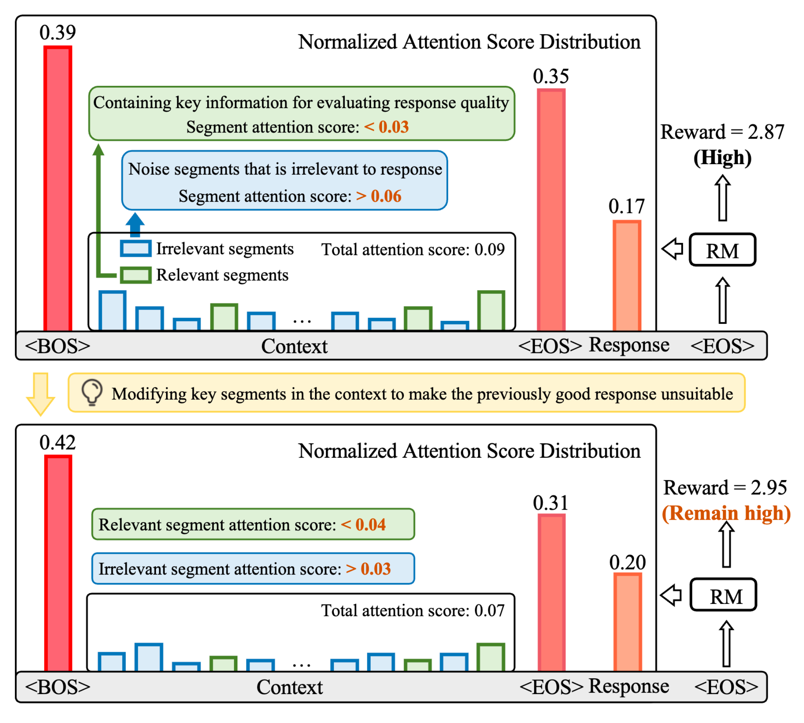
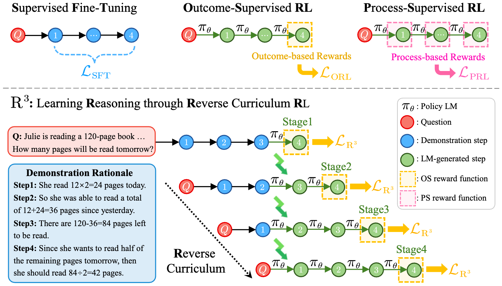
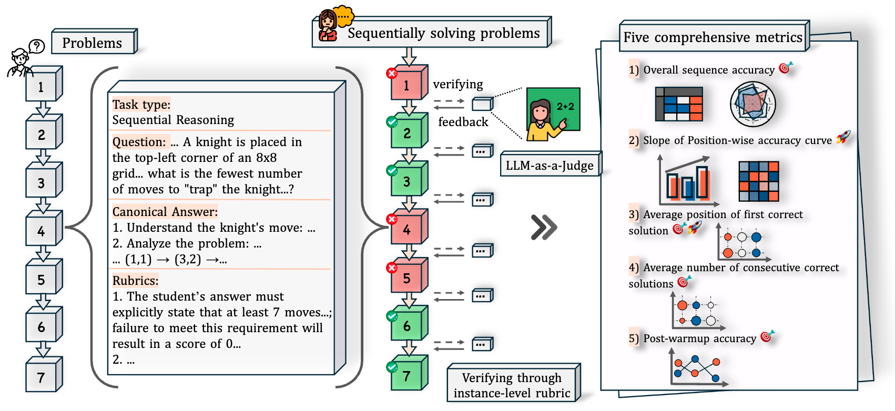
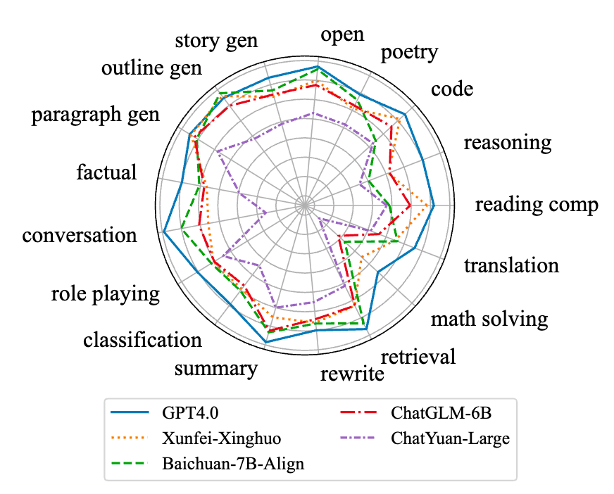
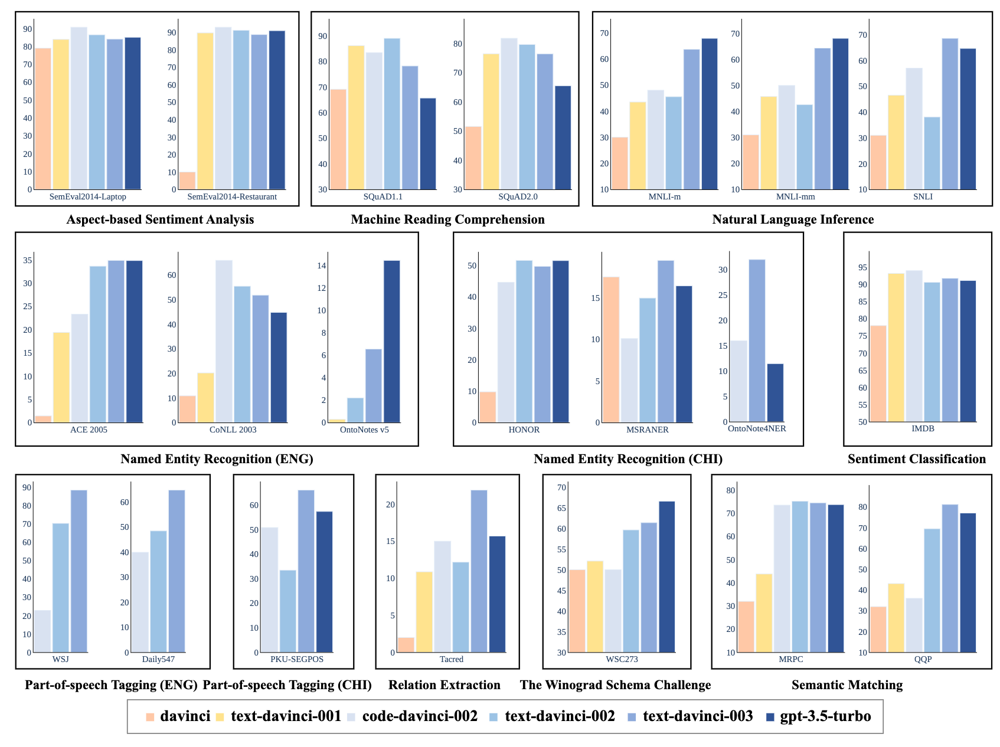








<!--
 My research interest includes neural machine translation and computer vision. I have published more than 100 papers at the top international AI conferences with total <a href='https://scholar.google.com/citations?user=DhtAFkwAAAAJ'>google scholar citations <strong>260000+</strong></a> (You can also use google scholar badge ).
-->
I'm currently a Master's degree student (from fall, 2024) at the [School of Computer Science](https://cs.fudan.edu.cn/) of [Fudan University](https://www.fudan.edu.cn/) and a member of the [FudanNLP Lab](https://nlp.fudan.edu.cn/), co-advised by Prof. [Xuanjing Huang (黄萱菁)](https://xuanjing-huang.github.io/) and Associate Prof. [Tao Gui(桂 韬)](https://guitaowufeng.github.io/).Previously, I got my bachelor's degree from Fudan University, advised by Associate Prof. [Tao Gui](https://guitaowufeng.github.io/).

# 🔥 News

- *2025.9*: &nbsp;🎉🎉 **POLAR** and **Evalearn** are accepted by **NeurIPS 2025**!
- *2025.7*: &nbsp;🎉🎉 Our paper on Reward Model Pre-training, **POLAR**, is now available on !
- *2024.5*: &nbsp;🎉🎉 One paper on math reasoning & RL was accepted by **ICML-2024**!
- *2024.3*: &nbsp;🎉🎉 One paper on in-context learning was accepted by **NAACL-2024-Findings**!
- *2023.12*: &nbsp;🎉🎉 One paper on evaluation was accepted by **AAAI-2024**!

# 💻 Internships
- **2025.1 - 2025.3** Large Language Model Center Group of [Shanghai Artificial Intelligence Laboratory](https://www.shlab.org.cn/) Shanghai, China.
- **2024.8 - 2024.12** Bytedance, AI Lab Research Shanghai, China
- **2023.12 - 2024.3** General Safety Group of [Shanghai Artificial Intelligence Laboratory](https://www.shlab.org.cn/) Shanghai, China.

# 📝 Publications 

## **Reward Modeling**

NeurIPS 25

### POLAR: Pre-Trained Policy Discriminators are General Reward Models

Shihan Dou\*<small>‡</small>, **Shichun Liu**\*<small>‡</small>, Yuming Yang\*, Yicheng Zou\*<small>†</small>, Yunhua Zhou, Shuhao Xing, Chenhao Huang, Qiming Ge, Demin Song, Haijun Lv, Songyang Gao, Chengqi Lv, Enyu Zhou, Honglin Guo, Zhiheng Xi, Wenwei Zhang, Qipeng Guo, Qi Zhang, Xipeng Qiu, Xuanjing Huang, Tao Gui<small>†</small>, Kai Chen<small>†</small>
 <small>\*Equal contributions. †Corresponding authors. ‡Work done during an internship at Shanghai AI Laboratory.</small>

- Say goodbye to reward models with poor generalization! POLAR (Policy Discriminative Learning) is a groundbreaking pre-training paradigm that trains reward models to distinguish policy distributions, eliminating heavy reliance on human preference data!
- Highly scalable and tailored for Reinforcement Fine-tuning (RFT)! POLAR assigns rewards based on ground truths, seamlessly integrating into the RFT framework and significantly reducing reward hacking across general tasks!
-  \|   \| 

ACL 2025

### Lost in the Context: Insufficient and Distracted Attention to Contexts in Preference Modeling

Shihan Dou\*, Jiayi Chen\*, Chenhao Huang\*, Feng Chen, Wei Chengzhi, Huiyuan Zheng, **Shichun Liu**, Yan Liu, Chenxiao Liu, Chao Xin, Lin Yan, Zongzhang Zhang, Tao Gui, Qi Zhang, Xuanjing Huang

- The reward model (RM) in RLHF often overlooks crucial context, leading to poor preference alignment. We find that the RM allocates insufficient attention to the context and ignores relevant segments. 
- To address this, we propose **AttnRM**, a novel optimization framework that directs the RM's focus to important contextual information. Experimental results show that AttnRM significantly enhances preference modeling, generalizability, and alignment with human preferences.
- 

## Reasoning

NAACL 2024 (Findings)

### Self-Demos: Eliciting Out-of-Demonstration Generalizability in Large Language Models

Wei He, **Shichun Liu**, Jun Zhao, Yiwen Ding, Yi Lu, Zhiheng Xi, Tao Gui, Qi Zhang, Xuanjing Huang.

- Goal: develop a method that can enhance the generalizability of LLMs when encountering OOD queries, allowing them to better adapt to novel tasks.
- Through extensive experiments on the tool-using scenario (OOD-Toolset) and mathematical problem-solving tasks (GSM8K and MATH datasets), SELF-DEMOS demonstrated superior performance in handling OOD queries compared to existing state-of-the-art methods.
-  \|  

ICML 2024

### Training Large Language Models for Reasoning through Reverse Curriculum Reinforcement Learning

Zhiheng Xi\*, Wenxiang Chen\*, Boyang Hong\*, Senjie Jin\*, Rui Zheng, Wei He, Yiwen Ding, **Shichun Liu**, Xin Guo, Junzhe Wang, Honglin Guo, Wei Shen, Xiaoran Fan, Yuhao Zhou, Shihan Dou, Xiao Wang, Xinbo Zhang, Peng Sun, Tao Gui, Qi Zhang, Xuanjing Huang

- We propose **R3**, a novel method that achieves the benefits of process supervision using only outcome supervision. R3 learns reasoning via a reverse curriculum, progressively moving from easy to hard tasks and enabling precise, step-level feedback.
- Our method surpasses RL baselines on eight reasoning tasks by 4.1 points on average, and with CodeLlama-7B, it performs comparably to much larger models without extra data.
-  \| 

## Evaluation

NeurIPS 25

### EvaLearn: Quantifying the Learning Capability and Efficiency of LLMs via Sequential Problem Solving

Shihan Dou, Ming Zhang, Chenhao Huang, Jiayi Chen, Feng Chen, **Shichun Liu**, Yan Liu, Chenxiao Liu, Cheng Zhong, Zongzhang Zhang, Tao Gui, Chao Xin, Wei Chengzhi, Lin Yan, Qi Zhang, Yonghui Wu, Xuanjing Huang

- We introduce **EvaLearn**, a benchmark to evaluate the learning capability of LLMs through sequential problem-solving, where models learn from prior experience.
- It features 648 problems in 182 sequences and five metrics, revealing that static ability doesn't always correlate with learning capability, thus offering a new dimension for model evaluation.
-  \| 

AAAI 2024

### LLMEval: A Preliminary Study on How to Evaluate Large Language Models

Yue Zhang\*, Ming Zhang\*, Haipeng Yuan, **Shichun Liu**, Yongyao Shi, Tao Gui, Qi Zhang, Xuanjing Huang

- Addresses the crucial "how to evaluate" question for LLMs, analyzing various criteria, scoring methods, and ranking systems.
- Introduces the LLMEval dataset, based on evaluations of 20 LLMs with over 240,000 manual annotations, and offers 10 key insights for future evaluation.
-  \| 

Arxiv

### A Comprehensive Capability Analysis of GPT-3 and GPT-3.5 Series Models

Junjie Ye\*, Xuanting Chen\*, Nuo Xu, Can Zu, Zekai Shao, **Shichun Liu**, Yuhan Cui, Zeyang Zhou, Chao Gong, Yang Shen, Jie Zhou, Siming Chen, Tao Gui, Qi Zhang, Xuanjing Huang

- We analyze the capability evolution of six GPT-3 and GPT-3.5 models on 21 NLU datasets.
- Our findings reveal that model capabilities do not uniformly improve with evolution, as strategies like RLHF can sometimes compromise performance on specific tasks while enhancing others.
- 

## Others

-  Multi-Programming Language Sandbox for LLMs
  Shihan Dou\*, Jiazheng Zhang\*, Jianxiang Zang\*, Yunbo Tao, Weikang Zhou, Haoxiang Jia, **Shichun Liu**, Yuming Yang, Shenxi Wu, Zhiheng Xi, Muling Wu, Rui Zheng, Changze Lv, Limao Xiong, Shaoqing Zhang, Lin Zhang, Wenyu Zhan, Rongxiang Weng, Jingang Wang, Xunliang Cai, Yueming Wu, Ming Wen, Yixin Cao, Tao Gui, Xipeng Qiu, Qi Zhang, Xuanjing Huang
   \| 

-  TransferTOD: A Generalizable Chinese Multi-Domain Task-Oriented Dialogue System with Transfer Capabilities
  Ming Zhang\*, Caishuang Huang\*, Yilong Wu\*, **Shichun Liu**, Huiyuan Zheng, Yurui Dong, Yujiong Shen, Shihan Dou, Jun Zhao, Junjie Ye, Qi Zhang, Tao Gui, Xuanjing Huang
  

# 🎖 Honors and Awards
- *2024.06*，the Top Students Award in Computer Science in recognition of his exceptional academic performance in the National Top Talent Undergraduate Training Program.
- *2022.09*, the First prize (Top 0.6% of 49242 teams) of Contemporary Undergraduate Mathematical Contest in Modeling (CUMCM).
- *2021.12*, the Second Prize of the Scholarship for Outstanding Students at Fudan University in the 2020-2021 academic year.
- *2021.12*, the Second Prize Winner(Non-Physics A) in the 38th National Physics Competition for College Students.
- *2021.12, 2022.12*, the Second Prize Winner(Non-Math) in the 13, 14th National Mathematics Competition for College Students.

# 📖 Educations
- *2020.9 - 2024.6*, B.E. at Fudan University with a major in computer science and technology.

<!--
# 💬 Invited Talks
-->
p
# 💡Services
- *2025.1* Reviewer of the 63rd Annual Meeting of the Association for Computational Linguistics (ACL 2025).

# 🌏 Visitors

  

